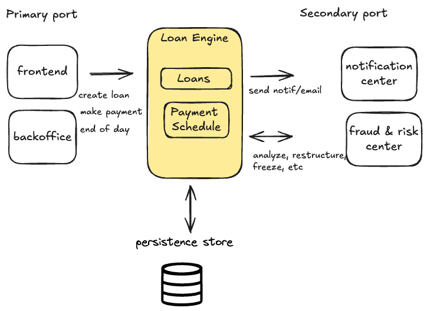
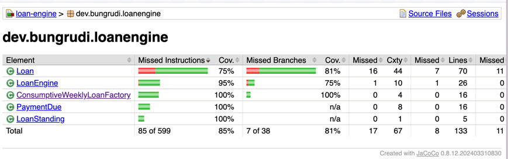
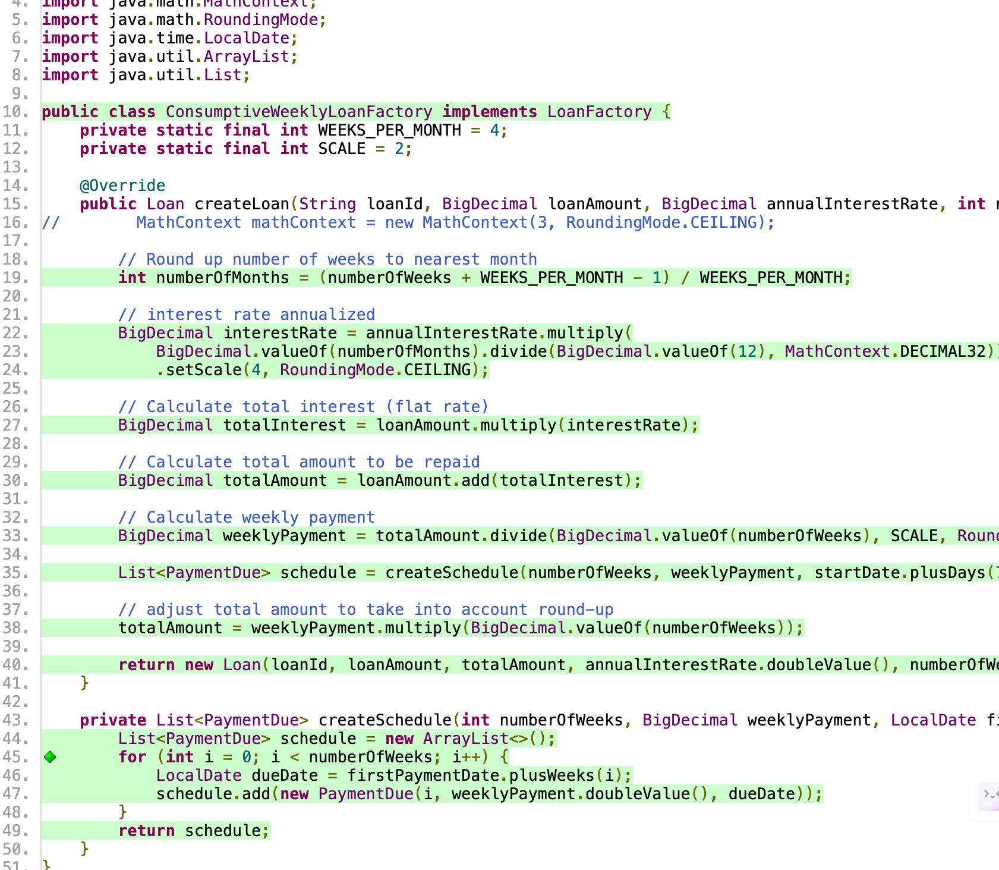

# Loan Engine Project

## Business Requirement

This project implements a loan engine system designed to manage loan creation, payment processing, and status tracking. As a sample implementation, a "consumptive weekly loan" logic is implemented:
- weekly payment schedule
- flat annual interest rate. see [simulation](https://docs.google.com/spreadsheets/d/1leQOBwH3VbX9TSuvTQr2NJ3cHMDY0btLy6r3Hr3Ztys/edit?usp=sharing).
- status "delinquent" after missed 2 repayments. 

## Domain Objects and Business Logic

The project is structured around several key domain objects that abstract the business logic:

1. **Loan**: Represents a loan with properties such as loan amount, interest rate, duration, and payment schedule. It encapsulates logic for payment processing, outstanding balance calculation, and loan status updates.

2. **LoanEngine**: Acts as the central coordinator for loan-related operations. It manages multiple loans, handles loan creation, processes payments, and performs daily updates.

3. **LoanFactory**: An interface for creating loan objects, allowing for different types of loans to be implemented.

4. **ConsumptiveWeeklyLoanFactory**: An implementation of LoanFactory specifically for creating consumptive weekly loans.

5. **PaymentDue**: Represents individual payments in a loan's repayment schedule.

6. **LoanStanding**: An enumeration representing the current status of a loan (e.g., good standing, delinquent).

On a high-level architectural view, the system can be illustrated as follows: 

This project implements the yellow highlighted box. Moving forward, the vision is to really integrate with surrounding components as illustrated. 


## LoanFactory Contract

The LoanFactory interface serves as a contract for encapsulating loan servicing logic. It defines the method for creating loans with specific characteristics:

- Interest calculation
- Payment schedule generation
- Total amount calculation

This design allows for different loan types to be implemented by creating new classes that implement the LoanFactory interface. Each implementation can have its own logic for interest calculation, payment scheduling, and other loan-specific details.

## Loan Class and Future Extensibility

The current Loan class is designed to be extensible. In the future, specific subclasses of Loan can be created to encapsulate different servicing logic for various loan types. This could include:

- Different types of late payment penalties
- Early payment bonuses
- Varying interest rate structures
- Specialized payment schedules

By creating subclasses, each loan type can have its own unique behavior while still adhering to the general loan interface.

## Entity Interactions

1. **Loan Creation**:
   - The `LoanEngine` uses a `LoanFactory` (specifically `ConsumptiveWeeklyLoanFactory`) to create new `Loan` objects.
   - The factory calculates loan terms, including total amount, weekly payments, and generates a payment schedule.

2. **Payment Processing**:
   - When a payment is made, the `LoanEngine` calls the `makePayment` method on the corresponding `Loan` object.
   - The `Loan` updates its payment schedule, marking the appropriate `PaymentDue` as paid and recalculates the outstanding balance.

3. **Status Updates**:
   - The `LoanEngine` has an `endOfDay` method that updates the current date and calls `updateStatus` on each `Loan`.
   - Each `Loan` checks its payment schedule against the current date to determine if it's become delinquent.

4. **Delinquency Checking**:
   - The `LoanEngine` can check if a loan is delinquent by calling `isDelinquent` on the `Loan` object.
   - A `Loan` is considered delinquent if it has missed payments based on its schedule and the current date.

5. **Balance Inquiries**:
   - The `LoanEngine` can retrieve the outstanding balance of a loan by calling `getOutstanding` on the `Loan` object.

## Key Features

- Weekly payment schedule
- Automatic delinquency detection
- Daily status updates
- Flexible loan factory system for different loan types
- Extensible design for future loan types and servicing logic

This loan engine provides a robust framework for managing consumptive weekly loans, with clear separation of concerns and extensibility for future enhancements. The use of the LoanFactory interface and the potential for Loan subclasses allows for easy addition of new loan types and servicing logic as business requirements evolve.

## Running Tests and Viewing Reports

To run the tests and view the reports for this project, follow these steps:

1. **Install Java Development Kit (JDK)**:
   - Ensure you have JDK 21 or later installed on your system.
   - You can download it from [Oracle's website](https://www.oracle.com/java/technologies/javase-jdk11-downloads.html) or use OpenJDK. Easy install for MacOS is "brew install openjdk@21"
   - Verify the installation by running `java -version` in your terminal.

2. **Clone the Repository**:
   - Clone this repository to your local machine using Git:
     ```
     git clone [repository-url]
     cd [repository-name]
     ```

3. **Run Tests Using Gradle**:
   - This project uses Gradle as its build tool. You don't need to install Gradle separately as the project includes a Gradle wrapper.
   - To run the tests, execute the following command in the project root directory:
     ```
     ./gradlew test
     ```
   - On Windows, use `gradlew.bat test` instead.

4. **View Test Reports**:
   - After running the tests, Gradle will generate HTML reports.
   - You can find these reports in the `build/reports/tests/test` directory.
   - Open `index.html` in this directory with your web browser to view the detailed test results.

5. **Generate and View Coverage Reports** (if configured):
   - If JaCoCo or another code coverage tool is configured, you can generate coverage reports with:
     ```
     ./gradlew jacocoTestReport
     ```
   - The coverage report will typically be available in `build/reports/jacoco/test/html/index.html`.  


